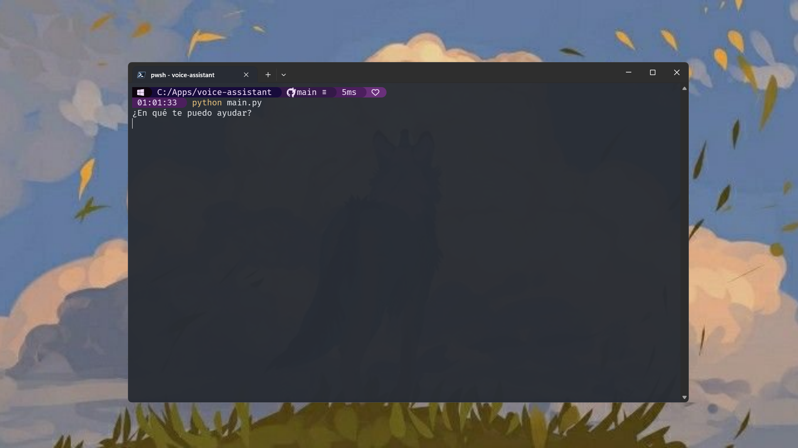

Script básico en Python para reconocimiento de voz a través de la librería Speech Recognition con el motor de reconocimiento de voz de Google.

Dentro de los comandos previamente programados estan:
- Abrir notepad
- Cerrar notepad
- Abrir navegador (Firefox)
